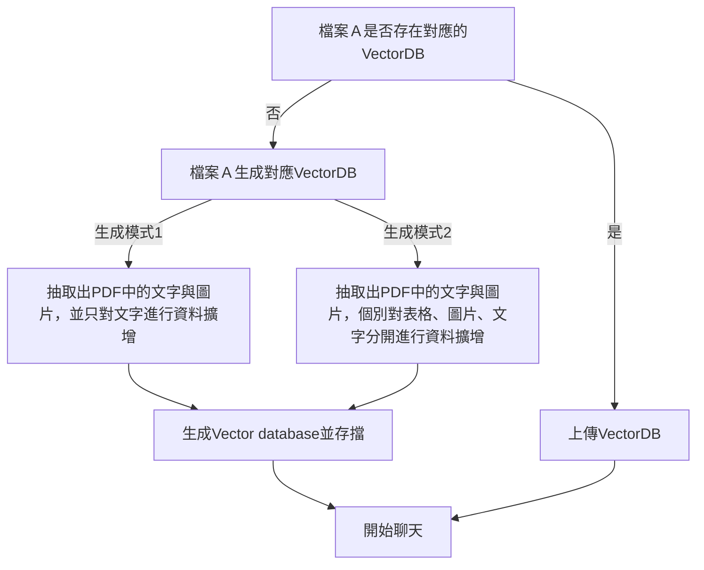

# moci-rag

## Preparation
### 在當前目錄下開啟`terminal`建立環境venv 
```
conda create -p venv python==3.9 -y
conda activate venv/
```
### 根據資料夾內的requirements.txt下在所需擴充包
```
pip install -r requirements.txt
```
### 安裝 BAAI/BGE-M3 環境 for vector embedding
詳細安裝教學請參考[北京智源人工智慧研究院](https://github.com/FlagOpen/FlagEmbedding/blob/master/FlagEmbedding/baai_general_embedding/README.md) github
```
git clone https://github.com/FlagOpen/FlagEmbedding.git
cd FlagEmbedding
pip install -e .
```
## Run application
```
streamlit run demo.py
```
## 檔案介紹
| File name | Description |
| --- | --- |
| `demo.py` | APP 運行主檔 |
| `drawUI.py` | 人機界面運行程序邏輯檔案 |
| `dataLoader.py` | for loading exsited data from vectorDB or new files |
| `modelLever.py` | include all functions used in this project |

### `demo.py`
在環境中輸入OPENAI_API_KEY

### `dataLoader.py`
- 在`drawUI.py`聊天室主要運行的function為此檔中的`processData()`, `processData()`會再去調用`modelLever.py`中的其他function
- `processData()`運行邏輯如下(目前整用生成模式1)

### `modelLever.py`
- 目前使用方法1，只會使用到其中的`retrieverGenerator()`與`askLLM()`兩個函示
  - `retrieverGenerator()`使用 BAAI/bge-m3 作為embedding model
  - embedding 後的資訊與對應圖片的uuid存入chroma資料庫中，而uuid對應圖片位置以pickle的形式儲存
- 方法2： 有鑒於目前MLLM對於圖片的識別能力效果不佳，暫時不採用
